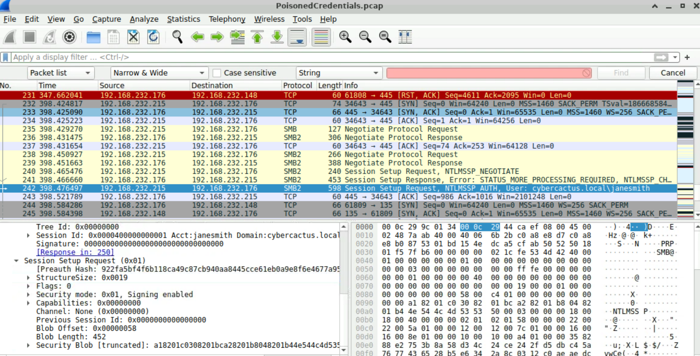
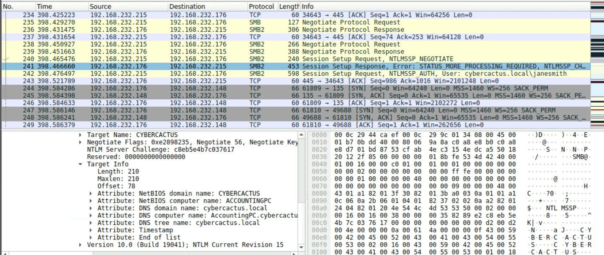

# CyberDefenders - Poisoned Credentials (PCAP) Write-up

**Challenge:** [Poisoned Credentials](https://cyberdefenders.org/blueteam-ctf-challenges/poisonedcredentials/)  
**Platform:** [CyberDefenders](https://cyberdefenders.org/)  
**Tags:** Network forensics, Wireshark, LLMNR/NBT-NS poisoning, SMB, NTLM

---

## Summary

Suspicious internal activity suggested **LLMNR/NBT-NS poisoning** — attackers respond to broadcast name-resolution queries (often triggered by typos) and capture **NTLM** authentication. Analysis of **`PoisonedCredentials.pcap`** in Wireshark shows victim **`192.168.232.162`** mistyped a NetBIOS name (**`FILESHAARE`**), rogue host **`192.168.232.215`** answered the query, and a second victim **`192.168.232.176`** received poisoned responses. The attacker captured credentials for **`janesmith`** and relayed SMB authentication toward **`ACCOUNTINGPC`**.

---

## Scenario

Your organization's security team has detected a surge in suspicious network activity. There are concerns that LLMNR (Link-Local Multicast Name Resolution) and NBT-NS (NetBIOS Name Service) poisoning attacks may be occurring within your network. These attacks are known for exploiting these protocols to intercept network traffic and potentially compromise user credentials.

---

## Objectives

- Investigate network logs and captured traffic in **`PoisonedCredentials.pcap`**.
- Identify the mistyped query, rogue responder, and affected hosts.
- Determine compromised username and target hostname accessed via SMB/NTLM.

---

## Environment

- **Artifact:** `PoisonedCredentials.pcap`
- **Tools:** Wireshark (filters: `nbns`, `llmnr`, `smb2`, `ntlmssp`)

---

## Evidence & Findings (Wireshark)

### T1 — Mistyped NBNS query (victim 192.168.232.162)

**Question:** Can you identify the specific mistyped query made by the machine with IP **`192.168.232.162`**?

- **What I checked:** NBNS traffic sourced from the victim IP.
- **Evidence (filter):**

  ```text
  ip.src == 192.168.232.162 && nbns
  ```

  Packet **47** — NBNS name query: **`FILESHAARE<20>`** (typo for a file share name such as `FILESHARE`).

- **Reasoning:** When DNS fails, Windows falls back to broadcast name resolution (NBNS/LLMNR). A typo broadcasts a query the attacker can answer.

**Answer:** **`FILESHAARE `** (NBNS query name; lab accepts the mistyped share string)

---

### T2 — Rogue machine IP

**Question:** What is the IP address of the machine acting as the rogue entity?

- **What I checked:** NBNS **responses** to the mistyped query shortly after packet 47.
- **Evidence:** Packet **51** — NBNS answer for **`FILESHAARE`**, responder IP **`192.168.232.215`** (not the legitimate file server).
- **Reasoning:** The rogue host impersonates the mistyped name and poisons resolution so the victim connects to the attacker.

**Answer:** **`192.168.232.215`**

---

### T3 — Second victim (poisoned response)

**Question:** What is the IP address of the second machine that received poisoned responses from the rogue machine?

- **What I checked:** Subsequent NBNS responses from **`192.168.232.215`** to other hosts on the segment.
- **Evidence:** Rogue machine sends poisoned NBNS answers to **`192.168.232.176`** after the initial poisoning chain.
- **Reasoning:** Multiple workstations can receive fraudulent name-resolution replies from the same attacker.

**Answer:** **`192.168.232.176`**

---

### T4 — Compromised username

**Question:** What is the username of the account that the attacker compromised?

- **What I checked:** SMB2 session setup from rogue IP **`192.168.232.215`** toward **`192.168.232.176`**; NTLM authentication fields.
- **Evidence:** SMB2 **Session Setup Request** — **`NTLMSSP_AUTH`**, user **`cybercactus.local\janesmith`**.

  

- **Reasoning:** After poisoning, the victim authenticates to the attacker's SMB listener; the username appears in the NTLMSSP auth blob (Net-NTLM hash capture / relay setup).

**Answer:** **`janesmith`**

---

### T5 — Hostname accessed via SMB (relay target)

**Question:** What is the hostname of the machine that the attacker accessed via SMB?

- **What I checked:** NTLM **challenge response** from **`192.168.232.176`** (packet **241**) — **Target Info** in NTLMSSP.
- **Evidence:**

  | Target Info field | Value |
  |-------------------|--------|
  | NetBIOS domain name | `CYBERCACTUS` |
  | NetBIOS computer name | **`ACCOUNTINGPC`** |
  | DNS computer name | `AccountingPC.cybercactus.local` |

  

- **Reasoning:** After capturing **`janesmith`**'s auth, the attacker relays SMB/NTLM toward the real target; **`ACCOUNTINGPC`** is the NetBIOS hostname of the machine being accessed.

**Answer:** **`ACCOUNTINGPC`**

---

## Attack Reconstruction

```text
192.168.232.162  --typo-->  NBNS query "FILESHAARE"
        |
        v
192.168.232.215  --poisoned answer-->  impersonates share / captures auth
        |
        +--> poisons 192.168.232.176
        |
        v
NTLM capture: cybercactus.local\janesmith
        |
        v
SMB relay toward ACCOUNTINGPC (192.168.232.176 as intermediary)
```

1. User on **`.162`** mistypes share name → NBNS broadcast.
2. Rogue **`.215`** answers → victim sends NTLM to attacker (Responder-style poisoning).
3. Second host **`.176`** also receives poisoned NBNS replies.
4. Attacker obtains **`janesmith`** credentials and attempts SMB access to **`ACCOUNTINGPC`**.

---

## Key IOCs

| Type | Indicator |
|------|-----------|
| **Rogue host** | `192.168.232.215` |
| **Victims** | `192.168.232.162`, `192.168.232.176` |
| **Mistyped name** | `FILESHAARE` |
| **Compromised user** | `janesmith` (`cybercactus.local`) |
| **Relay target** | `ACCOUNTINGPC` |
| **Protocols** | NBNS, SMB2, NTLMSSP |

---

## MITRE ATT&CK

| Technique | Name |
|-----------|------|
| **T1557.001** | Adversary-in-the-Middle: LLMNR/NBT-NS Poisoning and SMB Relay |
| **T1110** | Brute Force (offline hash cracking, if applicable) |
| **T1021.002** | Remote Services: SMB/Windows Admin Shares |

---

## Mitigation / Hardening

- Disable **LLMNR** and **NetBIOS over TCP/IP** on workstations where not required (GPO).
- Enable **SMB signing** and **EPA**; restrict NTLM where possible (prefer Kerberos).
- Segment LANs; monitor for hosts answering NBNS/LLMNR for names they don't own.
- Alert on **`192.168.232.215`-style** behavior: rapid NBNS responses + SMB445 from non-file-server IPs.

---

## References

- Challenge: https://cyberdefenders.org/blueteam-ctf-challenges/poisonedcredentials/
- MITRE T1557.001: https://attack.mitre.org/techniques/T1557/001/
