# Splunk BOSS — Dragos 1UP Your ICS/OT Cybersecurity Team Write-up

**Challenge:** [BOTS — 1UP Your ICS/OT Cybersecurity Team (Dragos)](https://bots.splunk.com/)  
**Platform:** [Splunk Boss of the SOC (BOTS)](https://bots.splunk.com/) + [Dragos](https://www.dragos.com/)  
**Tags:** SOC triage, Splunk, ICS/OT, Dragos

---

## Summary

**BOTS Scenario 1** blends IT and OT telemetry in Splunk with Dragos industrial detections. Thirty-two CTF questions cover **Allen-Bradley LOGIX5561** PLC inventory, **Usermemory** tampering, **CIP** abuse, **pylogix/pycomm3** reference items, **Metasploit** reverse shells (**`10.0.0.131`**), **EternalBlue (MS17-010)**, **PowerShell Empire**, **MSSQL `xp_cmdshell`**, Siemens **`.jar`** downloads, non-standard **RDP**, and **Nmap** enumeration. Key OT compromise signal: asset **21151** — first post-compromise alert **`PLC Date/Time Change`**.

---

## Scenario

BOTS scenario 1 **‘1UP Your ICS/OT Cybersecurity Team’** is an Industrial Control System (ICS) Cybersecurity 101 with Dragos. This capture-the-flag (CTF) scenario upskills your team on Operational Technology (OT), ICS and SCADA cybersecurity topics in a fun and engaging way.

Topics include control logic modifications, maintaining persistence inside networks, implementing command & control (C2), and more.

---

## Objectives

- Use Splunk + Dragos datasets to answer ICS/OT and converged IT/OT incident questions.
- Identify PLC assets, malicious modifications, C2, offensive tooling, and network visibility gaps.

---

## Environment

- **Platform:** Splunk BOTS (`bots.splunk.com`) — Dragos Partner Experience
- **Data sources:** Dragos industrial alerts, network telemetry, asset inventory, IT security events (Metasploit, Empire, SMB exploits)
- **Tools:** Splunk Search, Dragos alert fields (Source ID, asset ID), pylogix / pycomm3 documentation (reference questions)

**Typical Splunk pivots:**

```spl
index=* "1756-L61" OR "LOGIX5561"
index=* dest_ip=10.0.0.131 OR src_ip=10.0.0.128
index=* "Usermemory" OR "Get Attribute List"
index=* sourcetype=*dragos* OR vendor=Dragos
```

---

## Evidence & Findings (Splunk / Dragos)

### T1 — PLC status change notify host

**Question:** When the **1756-L61/B LOGIX5561** PLC status changes, which host is notified?

- **What I checked:** Dragos asset/alert data for **LOGIX5561** or **1756-L61** status-change events; notify/destination host fields.
- **Evidence:** Status-change notification tied to **`192.168.97.6`**.

  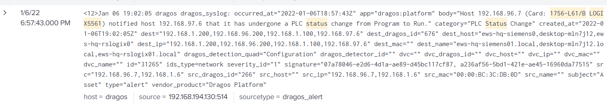

- **Reasoning:** Engineering or monitoring hosts receive PLC state-change alerts in Dragos telemetry.

**Answer:** **`192.168.97.6`**

---

### T2 — PLC card manufacturer

**Question:** Who is the manufacturer of the card?

- **What I checked:** Asset inventory / Dragos metadata for the **1756-L61/B LOGIX5561** controller.
- **Evidence:** Manufacturer field — **Allen-Bradley** (Rockwell Automation family).
- **Reasoning:** 1756-L61 controllers are Allen-Bradley Logix platforms.

**Answer:** **`Allen-Bradley`**

---

### T3 — User memory size

**Question:** What is the user memory size (in MB)?

- **What I checked:** Controller specification fields in asset inventory for **1756-L61**.
- **Evidence:** User memory = **`2`** MB.
- **Reasoning:** Standard spec attribute for this controller model.

**Answer:** **`2`**

---

### T4 — TCP reverse shell destination

**Question:** What is the destination IP address of the TCP reverse shell?

- **What I checked:** Splunk for reverse-shell / Metasploit handler connections; `dest_ip` on inbound shell sessions.
- **Evidence:** Reverse shell traffic terminates at **`10.0.0.131`**.

  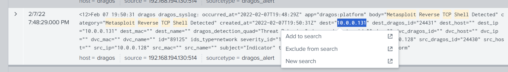

- **Reasoning:** Recurring C2 anchor across multiple shell events in the scenario.

**Answer:** **`10.0.0.131`**

---

### T5 — pylogix processor slot parameter

**Question:** In pylogix, which configuration parameter is used to specify the processor slot?

- **What I checked:** [pylogix documentation](https://github.com/dmroeder/pylogix) — `Logix()` / `comm` object settings.
- **Evidence:** Slot is set via **`comm.ProcessorSlot`**.
- **Reasoning:** Required when connecting to Logix controllers on non-default slot numbers.

**Answer:** **`comm.ProcessorSlot`**

---

### T6 — pylogix route-through value

**Question:** In pylogix, what value is used to route through another device?

- **What I checked:** pylogix docs — routing / path configuration options.
- **Evidence:** Route-through option value: **`Route`**.
- **Reasoning:** Used when the PLC is reached via a gateway or bridge device.

**Answer:** **`Route`**

---

### T7 — pylogix tag enumeration

**Question:** In pylogix, what value is used to enumerate all controller/program tags?

- **What I checked:** pylogix docs — tag discovery / enumeration methods.
- **Evidence:** Enumeration method: **`GetTagList`**.
- **Reasoning:** Returns the full tag list from the controller program.

**Answer:** **`GetTagList`**

---

### T8 — Metasploit speak_pwned hostname

**Question:** What is the hostname associated with the Metasploit **`windows/speak_pwned`** alert?

- **What I checked:** Splunk for Metasploit module **`speak_pwned`**; host/dest hostname fields.
- **Evidence:** Alert hostname **`srv-hq-nas01`**.

  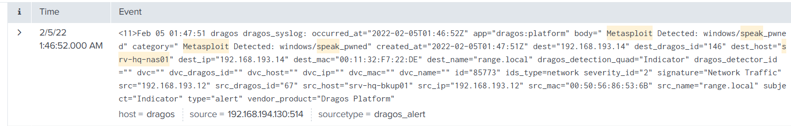

- **Reasoning:** Post-exploitation module executed on the NAS host after compromise.

**Answer:** **`srv-hq-nas01`**

---

### T9 — Offensive PowerShell tool

**Question:** Which offensive PowerShell tool is detected in the environment?

- **What I checked:** Splunk for PowerShell post-exploitation framework signatures / alert names.
- **Evidence:** **`Powershell Empire`** (PowerShell Empire).

  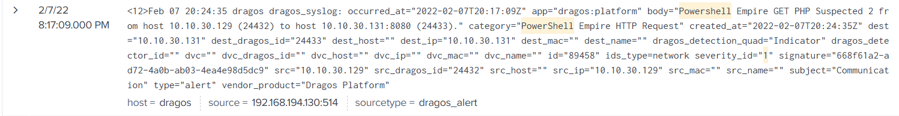

- **Reasoning:** Empire is a common PowerShell C2/post-ex framework seen in IT segments of converged environments.

**Answer:** **`Powershell Empire`**

---

### T10 — MS17-010 target MAC

**Question:** What is the MAC address of the MS17-010 (EternalBlue) target?

- **What I checked:** Splunk for **MS17-010** / EternalBlue exploit alerts; target MAC field.
- **Evidence:** Target MAC **`F8:DB:88:3E:83:A0`**.

  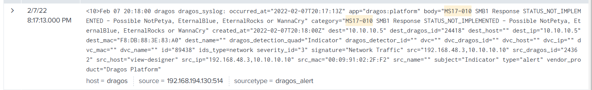

- **Reasoning:** SMB exploit telemetry records the victim's hardware address.

**Answer:** **`F8:DB:88:3E:83:A0`**

---

### T11 — Usermemory modifier host

**Question:** Which host modified **`Usermemory`** on **`192.168.1.6`** more than once?

- **What I checked:** Dragos / Splunk for **`Usermemory`** write events targeting **`192.168.1.6`**; count by source host.
- **Evidence:** Source host **`192.168.1.100`** with multiple modifications.
- **Reasoning:** Repeated Usermemory edits from a single host suggest unauthorized logic/memory tampering.

**Answer:** **`192.168.1.100`**

---

### T12 — CIP unauthorized command type

**Question:** On **`192.168.1.200`**, a CIP error was triggered by an unauthorized command from **`192.168.1.6`**. What was the request type?

- **What I checked:** CIP error / unauthorized command alerts involving **`192.168.1.6`** → **`192.168.1.200`**.
- **Evidence:** Request type **`Get Attribute List`**.

  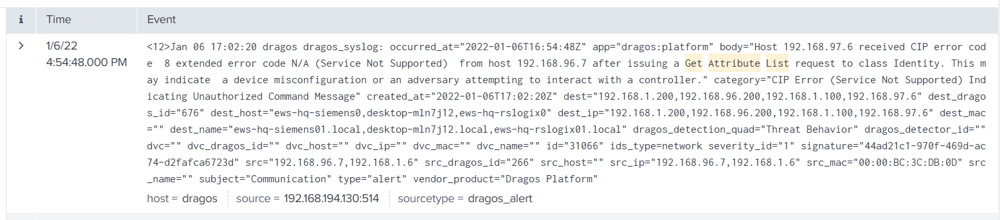

- **Reasoning:** Unauthorized attribute enumeration is a common CIP reconnaissance pattern.

**Answer:** **`Get Attribute List`**

---

### T13 — Highest port scanned (03:06)

**Question:** During the port scan at **03:06**, what is the highest port number scanned?

- **What I checked:** Network scan events timestamped around **03:06**; max destination port.
- **Evidence:** Highest scanned port **`1331`**.

  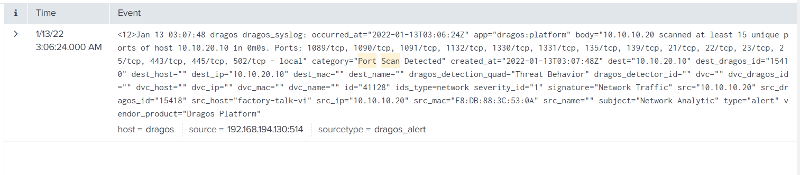

- **Reasoning:** Scan telemetry lists destination ports in ascending/descending order — take the maximum value.

**Answer:** **`1331`**

---

### T14 — Port scan origin hostname

**Question:** What is the hostname of the machine that originated the port scan?

- **What I checked:** Scan events at **03:06**; source hostname field.
- **Evidence:** Origin hostname **`factory-talk-vi`**.
- **Reasoning:** Aligns with Rockwell FactoryTalk engineering workstation naming.

**Answer:** **`factory-talk-vi`**

---

### T15 — File transfer access technique

**Question:** **`192.168.193.12`** received a file from **`192.168.2.2`**. What access technique was used?

- **What I checked:** File transfer / SMB / null-session alerts between **`192.168.2.2`** and **`192.168.193.12`**.
- **Evidence:** Access technique **`None Logon`** (null / anonymous logon).

  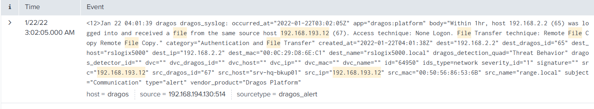

- **Reasoning:** File access without authenticated logon indicates null-session or guest access abuse.

**Answer:** **`None Logon`**

---

### T16 — Reverse shell from 10.0.0.128

**Question:** A Metasploit reverse TCP connection from **`10.0.0.128`** connects to which destination IP?

- **What I checked:** Splunk for `src_ip=10.0.0.128` reverse-shell / Metasploit handler traffic.
- **Evidence:** Destination **`10.0.0.131`**.

  

- **Reasoning:** Same C2 host as T4 — confirms the handler IP for this source.

**Answer:** **`10.0.0.131`**

---

### T17 — Top pycomm3 host

**Question:** Which host uses pycomm3 the most?

- **What I checked:** Splunk for pycomm3-related events / user-agent / process or library references; count by host.
- **Evidence:** Most active host **`192.168.212.226`**.

  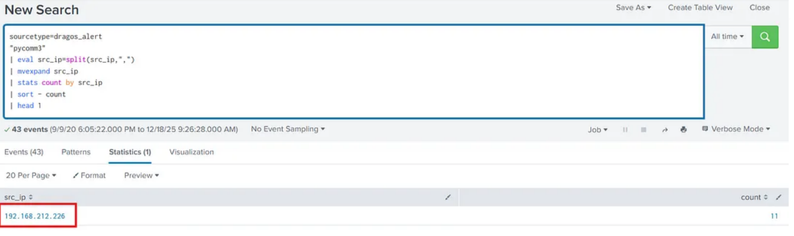

- **Reasoning:** Heavy pycomm3 usage may indicate engineering automation or unauthorized EtherNet/IP tag access.

**Answer:** **`192.168.212.226`**

---

### T18 — pycomm3 protocol

**Question:** Which protocol does pycomm3 use to read and write tag values?

- **What I checked:** [pycomm3 documentation](https://github.com/ottowayi/pycomm3).
- **Evidence:** Protocol **`EtherNet/IP`**.
- **Reasoning:** pycomm3 implements CIP over EtherNet/IP for Allen-Bradley controllers.

**Answer:** **`EtherNet/IP`**

---

### T19 — pycomm3 request_data data type

**Question:** In pycomm3, what is the data type for the **`request_data`** command?

- **What I checked:** pycomm3 CLI / API docs — `request_data` command parameters.
- **Evidence:** Data type **`any`**.
- **Reasoning:** Generic read/write requests accept flexible payload types.

**Answer:** **`any`**

---

### T20 — pycomm3 drivers

**Question:** Which pycomm3 drivers are installed? (Alphabetical order, comma-separated, no spaces)

- **What I checked:** pycomm3 documentation — installed driver list.
- **Evidence:** **`CIPDriver,LogixDriver,SLCDriver`**
- **Reasoning:** Three core drivers cover CIP generic, Logix, and SLC platforms.

**Answer:** **`CIPDriver,LogixDriver,SLCDriver`**

---

### T21 — pycomm3 PLC vendors

**Question:** Which PLC vendors does pycomm3 support? (Lowercase, comma-separated, no spaces)

- **What I checked:** pycomm3 documentation — supported vendor list.
- **Evidence:** **`allen-bradley,rockwell automation`**
- **Reasoning:** Rockwell Automation owns the Allen-Bradley brand; both appear in vendor support docs.

**Answer:** **`allen-bradley,rockwell automation`**

---

### T22 — Honeywell DSA Primary IP

**Question:** What is the Honeywell DSA Primary IP address?

- **What I checked:** Dragos asset inventory for Honeywell DSA Primary asset.
- **Evidence:** Primary IP **`10.1.0.101`**.

  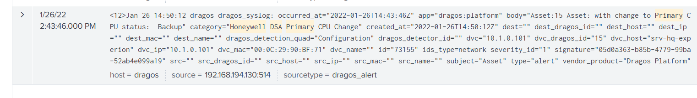

- **Reasoning:** DSA (Distributed System Architecture) Primary is a critical Honeywell safety/network node.

**Answer:** **`10.1.0.101`**

---

### T23 — MSSQL remote shell

**Question:** What is the popular shell used on the MSSQL server for remote command execution?

- **What I checked:** Splunk for SQL Server post-exploitation / stored procedure abuse alerts.
- **Evidence:** **`xp_cmdshell`**.

  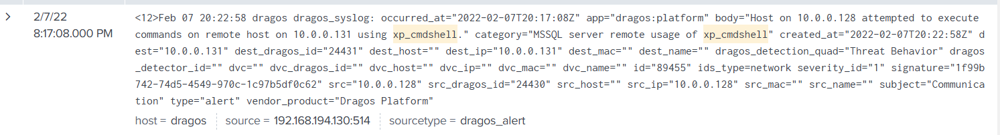

- **Reasoning:** Extended stored procedure that spawns a Windows command shell from SQL Server.

**Answer:** **`xp_cmdshell`**

---

### T24 — Enable xp_cmdshell command

**Question:** Which command is used to enable **`xp_cmdshell`** (disabled by default)?

- **What I checked:** SQL Server configuration / `sp_configure` references in alerts or documentation.
- **Evidence:** **`sp_configure`**.
- **Reasoning:** `sp_configure 'xp_cmdshell', 1` is the standard enablement path before `RECONFIGURE`.

**Answer:** **`sp_configure`**

---

### T25 — Asset 21151 first post-compromise alert

**Question:** What is the first post-compromise alert on asset **21151**?

- **What I checked:** Dragos alerts for asset ID **21151** chronologically after initial compromise indicators.
- **Evidence:** First alert type **`PLC Date/Time Change`**.

  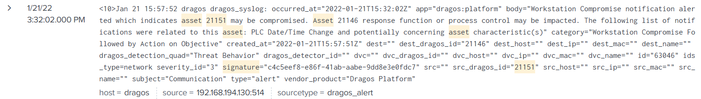

- **Reasoning:** Clock changes on PLCs are a common post-exploitation artifact after controller compromise.

**Answer:** **`PLC Date/Time Change`**

---

### T26 — Siemens download destination IP

**Question:** A Siemens-related host downloaded a file. What is the destination IP of the download?

- **What I checked:** Download / HTTP / file-transfer events involving Siemens hosts.
- **Evidence:** Download destination **`192.168.192.74`**.

  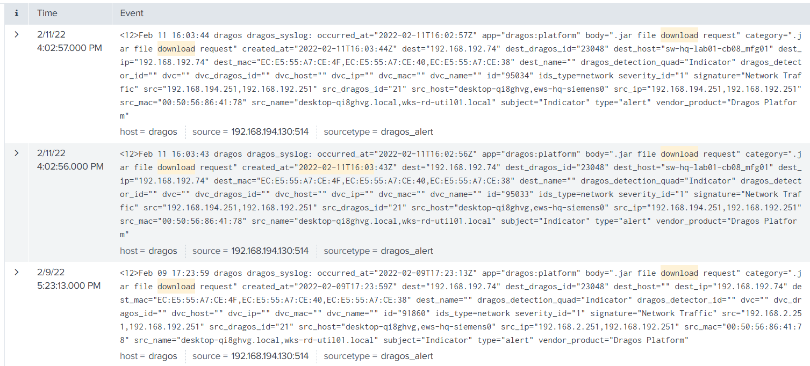

- **Reasoning:** Engineering workstation or HMI pulling files from this source IP.

**Answer:** **`192.168.192.74`**

---

### T27 — Downloaded file extension

**Question:** What is the extension of the downloaded file?

- **What I checked:** File name / extension field on the Siemens download event (T26).
- **Evidence:** Extension **`jar`**.
- **Reasoning:** Java archive — may be legitimate tooling or staged payload in OT context.

**Answer:** **`jar`**

---

### T28 — RDP on port 55555 source IP

**Question:** An RDP negotiation occurred on port **55555**. What is the source IP?

- **What I checked:** RDP / remote desktop events on non-standard port **55555**.
- **Evidence:** Source IP **`192.168.208.1`**.

  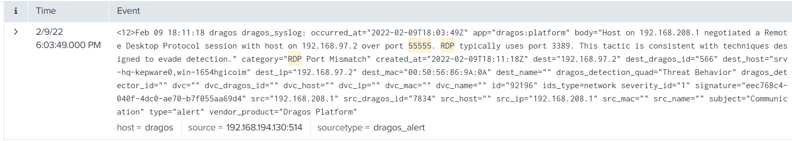

- **Reasoning:** Non-standard RDP port often used to evade simple port-based detection.

**Answer:** **`192.168.208.1`**

---

### T29 — Standard RDP port

**Question:** What is the standard RDP port number?

- **What I checked:** RDP baseline / reference (lab documentation or standard port mapping).
- **Evidence:** Standard port **`3389`**.
- **Reasoning:** Default Microsoft Remote Desktop Protocol listener port.

**Answer:** **`3389`**

---

### T30 — RDP forward destination hostname (Source ID 7834)

**Question:** An RDP forward alert (Dragos Source ID **7834**) connects to which destination hostname?

- **What I checked:** Dragos alert where **Source ID = 7834**; destination hostname field.
- **Evidence:** Destination hostname **`rshistorian`**.

  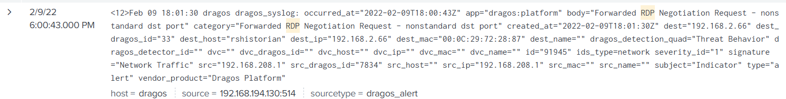

- **Reasoning:** Historian servers aggregate OT process data — high-value lateral-movement target.

**Answer:** **`rshistorian`**

---

### T31 — rshistorian Dragos ID

**Question:** What is the Dragos ID for **`rshistorian`**?

- **What I checked:** Dragos asset inventory search for hostname **`rshistorian`**.
- **Evidence:** Dragos asset ID **`33`**.
- **Reasoning:** Asset ID links historian alerts (e.g., T30) to inventory records.

**Answer:** **`33`**

---

### T32 — Nmap target from 192.168.208.1

**Question:** From **`192.168.208.1`**, which IP was targeted by Nmap?

- **What I checked:** Nmap / network discovery events with source **`192.168.208.1`**.
- **Evidence:** Scan target **`192.168.192.74`**.

  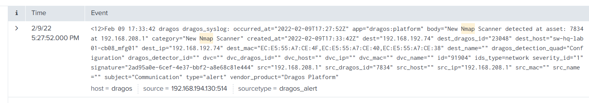

- **Reasoning:** Same host appears in Siemens download activity (T26) — ties enumeration to follow-on access.

**Answer:** **`192.168.192.74`**

---

## Key IOCs & assets

| Type | Indicator |
|------|-----------|
| **C2 IP** | `10.0.0.131` |
| **Reverse shell source** | `10.0.0.128` |
| **PLC** | Allen-Bradley 1756-L61/B LOGIX5561 |
| **PLC monitor** | `192.168.97.6` |
| **Usermemory tampering** | `192.168.1.100` → `192.168.1.6` |
| **pycomm3 host** | `192.168.212.226` |
| **Scanner / RDP source** | `192.168.208.1` |
| **Scan/download target** | `192.168.192.74` |
| **Historian** | `rshistorian` (Dragos ID **33**) |
| **Honeywell DSA Primary** | `10.1.0.101` |
| **NAS (Metasploit)** | `srv-hq-nas01` |

---

## MITRE ATT&CK (ICS + enterprise)

| Technique | Name | Scenario tie-in |
|-----------|------|-----------------|
| **T0855** | Unauthorized Command Message | CIP / PLC manipulation (T12) |
| **T0889** | Modify Program | Usermemory changes (T11) |
| **T0866** | Remote Services | RDP to historian (T28–T30) |
| **T1219** | Remote Access Software | Empire, Metasploit (T8–T9) |
| **T1210** | Exploitation of Remote Services | MS17-010 (T10) |
| **T1059.001** | PowerShell | PowerShell Empire (T9) |
| **T1505.001** | SQL Stored Procedures | xp_cmdshell (T23–T24) |
| **T1046** | Network Service Discovery | Port scan / Nmap (T13–T14, T32) |
| **T1071** | Application Layer Protocol | Reverse shell C2 (T4, T16) |

---

## References

- BOTS platform: https://bots.splunk.com/
- Dragos + Splunk BOTS announcement: https://www.dragos.com/blog/upskill-ics-ot-cybersecurity-with-splunk-bots-platform/
- pylogix: https://github.com/dmroeder/pylogix
- pycomm3: https://github.com/ottowayi/pycomm3
