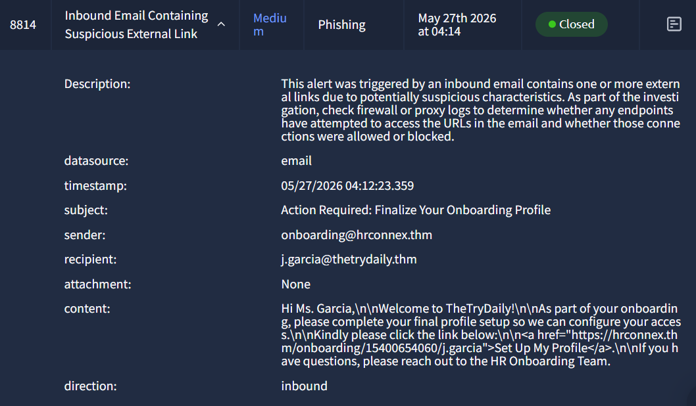
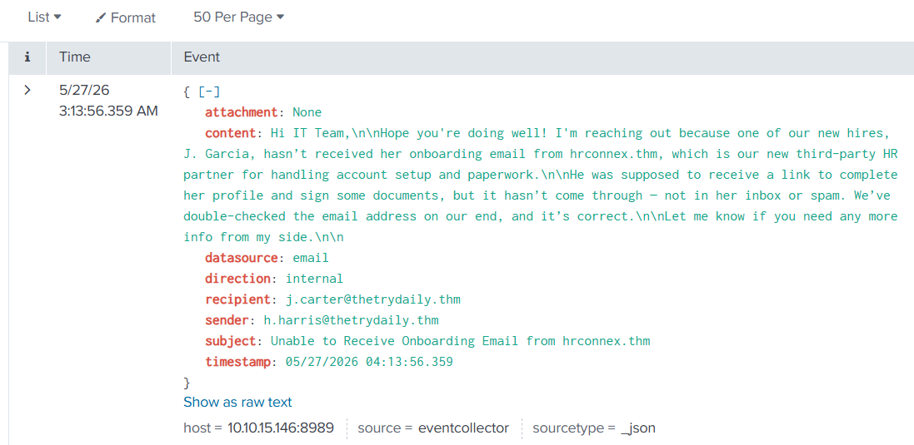
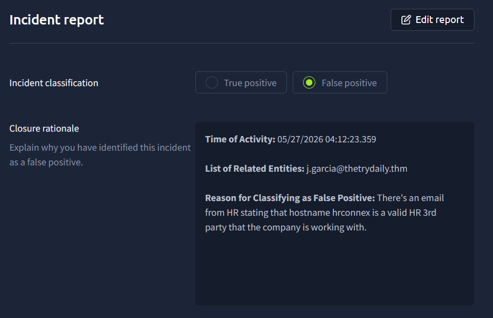
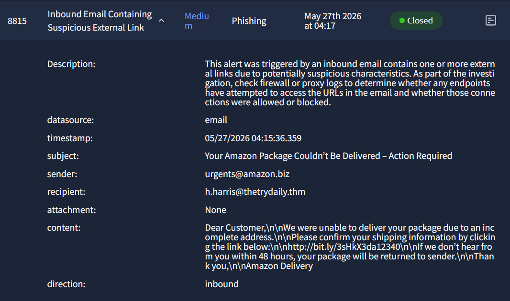
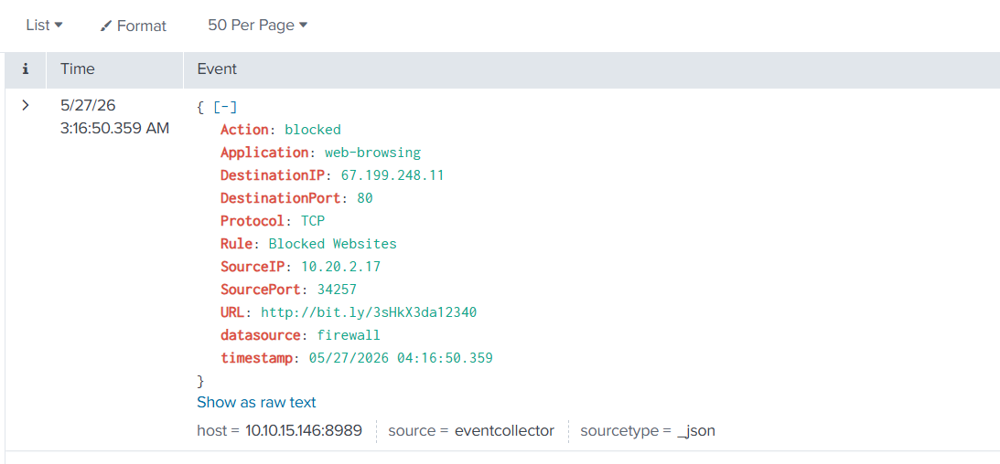
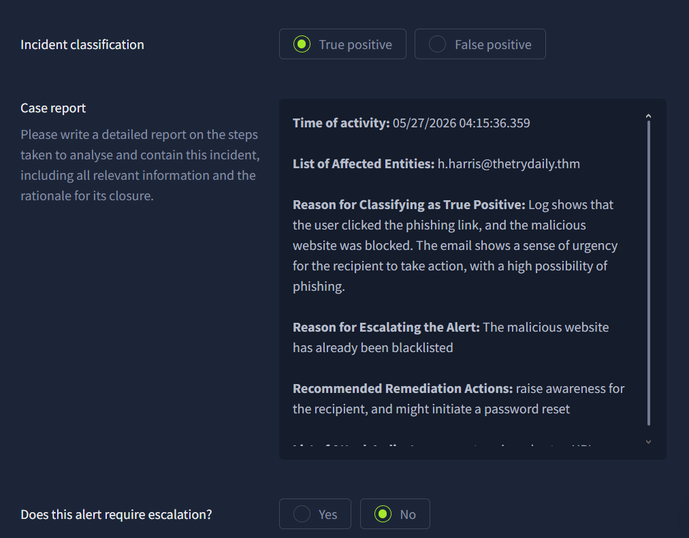
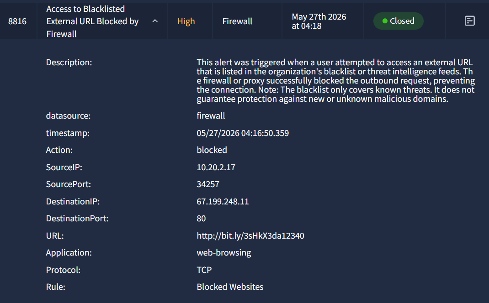
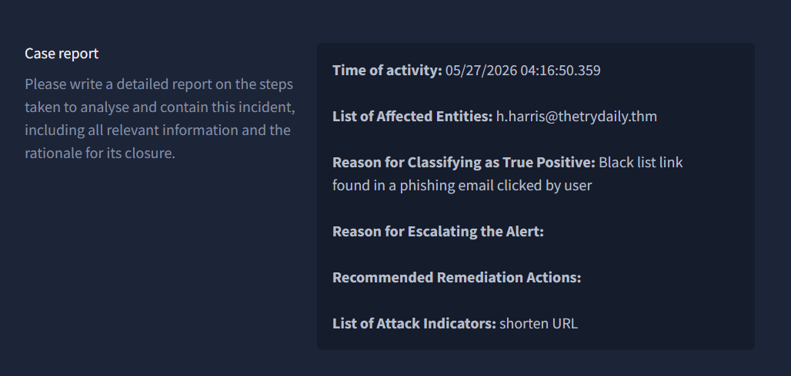
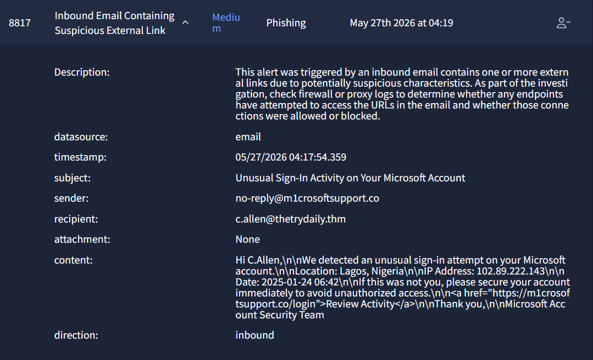
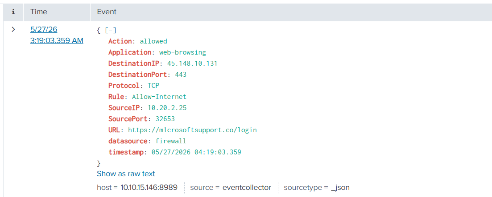

# TryHackMe - Introduction to Phishing (SOC Triage) Write-up

**Room:** Introduction to Phishing  
**Platform:** [TryHackMe](https://tryhackme.com/)  
**Path:** SOC Level 1 — Phishing triage  

**Date completed:** _YYYYMMDD_  
**Author:** _your name_  
**Tags:** SOC, Splunk, Phishing, Email Security, Firewall

---

## Summary

As a SOC analyst, I triaged four related security events in Splunk and completed incident reports for each. The workflow involved reviewing email alerts for suspicious links, validating domains and URLs using Splunk correlation and the Analyst VM check tool, and pivoting to firewall logs to determine whether users clicked links and whether connections were allowed or blocked. Event **8814** was a **false positive** (legitimate HR onboarding from `hrconnex.thm`). Events **8815** and **8816** were **true positives** tied to a phishing email sent to Harris (`urgents@amazon.biz`, bit.ly link); the malicious URL was blocked by the firewall and did not require escalation. Event **8817** was a **true positive** typosquatting campaign (`m1crosoftsupport.co`) where Allen clicked the link and the connection was **allowed** through the firewall, requiring credential reset and account auditing.

---

## Scenario

You are a SOC analyst analyzing phishing events on a SIEM platform (Splunk) and writing an action report for each alert. For every event you must determine whether it is a true or false positive, document affected entities, correlate email activity with firewall/proxy logs, and recommend remediation or escalation as appropriate.

---

## Objectives

- Triage inbound email alerts flagged for suspicious external links.
- Correlate email IOCs with firewall logs (allowed vs blocked).
- Classify incidents and complete structured incident reports.
- Recommend remediation (awareness, password reset, escalation) based on impact.

---

## Scope & Assumptions

- **Platform:** TryHackMe Analyst VM + Splunk (lab SIEM).
- **Events analyzed:** Alerts **8814**, **8815**, **8816**, **8817**.
- **Assumptions:**
  - Internal email from HR/IT confirming a third-party domain is treated as validation for false-positive closure.
  - Source IP mapping in Splunk identifies which endpoint/user initiated outbound connections.
  - “Escalation” is not required when the firewall already blocked the malicious destination (no successful compromise).

---

## Environment

- **Platform(s):** TryHackMe (Analyst VM, Splunk, incident reporting UI)
- **Investigation timeframe:** 2026-05-27 (~04:12–04:19 UTC, per alert timestamps)
- **Data sources:** Email security alerts, internal email logs, firewall logs (`datasource=firewall`)
- **Tools used:**
  - Splunk (search/correlation)
  - URL/domain check tool (Analyst VM)
  - Incident report form (true/false positive, escalation, remediation)

---

## High-Level Approach

Review each alert in the SOC queue → extract sender, recipient, subject, and embedded URL → search Splunk for domain/URL validation and user click behavior → map `SourceIP` to the affected user → classify true/false positive → document incident report with remediation and escalation decision.

---

## Evidence & Timeline

### Setup - _Splunk and analyst workflow_

- **What I checked:** Lab README for Splunk access; opened alerts in the SOC console.
- **Evidence:** Splunk searches against `hrconnex.thm`, `bit.ly`, `m1crosoftsupport.co`, and firewall `action=blocked|allowed`.
- **Reasoning:** Phishing triage requires correlating **email delivery** with **follow-on network activity** (did the user click? was it blocked?).

---

### T1 - Event 8814: Inbound email — suspicious external link (HR onboarding)

**Alert:** Inbound Email Containing Suspicious External Link  
**Severity:** Medium | **Category:** Phishing | **Status:** Closed

| Field | Value |
|-------|--------|
| **Timestamp** | 05/27/2026 04:12:23.359 |
| **Subject** | Action Required: Finalize Your Onboarding Profile |
| **Sender** | `onboarding@hrconnex.thm` |
| **Recipient** | `j.garcia@thetrydaily.thm` |
| **URL** | `https://hrconnex.thm/onboarding/15400654060/j.garcia` |

- **What I checked:** Splunk for `hrconnex.thm`; internal HR email confirming the domain; URL check tool on Analyst VM.
- **Evidence (Splunk):** Internal email from `h.harris@thetrydaily.thm` to IT stating HR confirmed `hrconnex.thm` is a valid third-party HR partner and that **J. Garcia** should receive onboarding mail.

- **Reasoning:** The link domain matches a vetted HR partner. No malicious intent indicators beyond the generic “suspicious link” rule. Legitimate onboarding email → **false positive**.

**Classification:** **False positive**  
**Affected entity:** `j.garcia@thetrydaily.thm`

---

### T2 - Event 8815: Inbound email — Amazon delivery phish (Harris)

**Alert:** Inbound Email Containing Suspicious External Link  
**Severity:** Medium | **Category:** Phishing

| Field | Value |
|-------|--------|
| **Timestamp** | 05/27/2026 04:15:36.359 |
| **Subject** | Your Amazon Package Couldn’t Be Delivered – Action Required |
| **Sender** | `urgents@amazon.biz` |
| **Recipient** | `h.harris@thetrydaily.thm` |
| **URL** | `http://bit.ly/3sHkX3da12340` |

- **What I checked:** Email content for urgency, sender authenticity, and URL obfuscation; Splunk for firewall activity on the bit.ly URL; source IP ownership.
- **Reasoning (email):**
  - **Urgency** (“48 hours” deadline) — common phishing tactic.
  - **Suspicious sender** — `amazon.biz` is not Amazon’s legitimate domain.
  - **Shortened URL** — hides final destination (high risk).
- **Evidence (Splunk — user clicked, firewall blocked):**

| Field | Value |
|-------|--------|
| **Action** | `blocked` |
| **SourceIP** | `10.20.2.17` (Harris) |
| **URL** | `http://bit.ly/3sHkX3da12340` |
| **DestinationIP** | `67.199.248.11` |
| **Rule** | Blocked Websites |

- **Reasoning (network):** Harris attempted to access the phishing link; the firewall blocked it. Malicious activity occurred, but **impact was contained** — no escalation required; still a **true positive**.

**Classification:** **True positive** (no escalation — URL blacklisted/blocked)  
**Remediation:** User awareness; consider password reset for `h.harris@thetrydaily.thm`

---

### T3 - Event 8816: Blacklisted URL blocked by firewall

**Alert:** Access to Blacklisted External URL Blocked by Firewall  
**Severity:** High | **Category:** Firewall

| Field | Value |
|-------|--------|
| **Timestamp** | 05/27/2026 04:16:50.359 |
| **Action** | `blocked` |
| **SourceIP** | `10.20.2.17` |
| **URL** | `http://bit.ly/3sHkX3da12340` |
| **DestinationIP** | `67.199.248.11` |

- **What I checked:** Correlation with Event 8815 (same URL, same source IP, same user).
- **Evidence:** Identical IOCs to the bit.ly link Harris clicked after the Amazon phish email.

- **Reasoning:** This alert is the **network-side confirmation** of the 8815 phishing click. User attempted to reach a **blacklisted** phishing URL; firewall succeeded. **True positive**; linked to Harris and the 8815 campaign.

**Classification:** **True positive**  
**Affected entity:** `h.harris@thetrydaily.thm`  
**Attack indicator:** Shortened URL (`bit.ly`)

---

### T4 - Event 8817: Typosquatting Microsoft phish (Allen) — allowed through firewall

**Alert:** Inbound Email Containing Suspicious External Link  
**Severity:** Medium | **Category:** Phishing

| Field | Value |
|-------|--------|
| **Timestamp** | 05/27/2026 04:17:54.359 |
| **Subject** | Unusual Sign-In Activity on Your Microsoft Account |
| **Sender** | `no-reply@m1crosoftsupport.co` |
| **Recipient** | `c.allen@thetrydaily.thm` |
| **URL** | `https://m1crosoftsupport.co/login` |

- **What I checked:** Sender domain for typosquatting; Splunk for firewall logs on the phishing URL; source IP to identify the user.
- **Reasoning (email):**
  - **Typosquatting** — `m1crosoft` (digit `1` instead of `i`) and `m1crosoftsupport.co` mimic Microsoft.
  - Classic **credential-harvesting** lure (fake sign-in alert, “Review Activity” link).
- **Evidence (Splunk — click allowed):**

| Field | Value |
|-------|--------|
| **Action** | `allowed` |
| **SourceIP** | `10.20.2.25` (Allen) |
| **URL** | `https://m1crosoftsupport.co/login` |
| **DestinationIP** | `45.148.10.131` |
| **Rule** | Allow-Internet |

- **Reasoning (network):** Allen clicked the link and the connection was **not blocked** — higher risk of credential compromise. **True positive** requiring stronger remediation than 8815.

**Classification:** **True positive**  
**Affected entity:** `c.allen@thetrydaily.thm`  
**Remediation:** Audit Allen’s account activity; **force credential reset**; consider escalation depending on lab policy.

---

## Indicators of Compromise (IOCs)

| Type | Indicator | Related event |
|------|-----------|----------------|
| **Domain (legitimate)** | `hrconnex.thm` | 8814 (FP) |
| **Domain (malicious)** | `amazon.biz` | 8815 |
| **URL (shortener)** | `http://bit.ly/3sHkX3da12340` | 8815, 8816 |
| **IP (blocked dest.)** | `67.199.248.11` | 8815, 8816 |
| **Domain (typosquat)** | `m1crosoftsupport.co` | 8817 |
| **URL (phish login)** | `https://m1crosoftsupport.co/login` | 8817 |
| **IP (allowed dest.)** | `45.148.10.131` | 8817 |
| **Internal IPs** | `10.20.2.17` (Harris), `10.20.2.25` (Allen) | 8815/8816, 8817 |

---

## Findings

| Event | Verdict | Key reason |
|-------|---------|------------|
| **8814** | False positive | HR-confirmed legitimate `hrconnex.thm` onboarding for Garcia |
| **8815** | True positive | Phishing email + user click; firewall **blocked** |
| **8816** | True positive | Same bit.ly IOC as 8815; blacklist block confirmed |
| **8817** | True positive | Typosquatting Microsoft phish; Allen click **allowed** — reset credentials |

---

## Attack Reconstruction (What likely happened)

1. **8814:** Garcia received a legitimate HR onboarding email from `hrconnex.thm`. IT internally confirmed the vendor — alert was a policy false match.
2. **8815 → 8816:** Harris received an urgent fake Amazon delivery email from `urgents@amazon.biz` with a **bit.ly** link. Harris clicked; the firewall blocked access to the resolved destination (`67.199.248.11`), generating a follow-on high-severity firewall alert (8816).
3. **8817:** Allen received a **typosquatted** Microsoft security alert from `m1crosoftsupport.co`. Allen clicked `https://m1crosoftsupport.co/login`; traffic was **allowed** under `Allow-Internet`, indicating potential exposure to a credential-harvesting page.

---

## Mitigation / Remediation

| Event | Action |
|-------|--------|
| **8814** | Close as false positive; document HR vendor approval for `hrconnex.thm`. |
| **8815** | True positive — no escalation (blocked); user awareness + optional password reset for Harris. |
| **8816** | True positive — document blacklist effectiveness; same user remediation as 8815. |
| **8817** | True positive — **mandatory credential reset** for Allen; audit account/session activity; consider blocking `m1crosoftsupport.co` at proxy/firewall. |

**Detection improvements:**

- Alert on typosquat patterns in sender domains (`m1crosoft`, etc.).
- Tighten policy for newly seen phishing domains even when traffic is HTTPS (8817 bypassed block lists).
- Correlate email alerts with firewall `allowed` events for the same URL within a short time window.

---

## Lessons Learned

- **False positives** still require validation (internal email + domain check), not only dismissing the alert.
- **Blocked clicks** are true positives with lower urgency — document why escalation is not needed.
- **Allowed clicks** to known phishing URLs require stronger response (reset, audit) than blocked attempts.
- Splunk correlation across `email` and `firewall` datasources is essential to tie recipients to `SourceIP` activity.

---

## References

- TryHackMe: Introduction to Phishing (SOC triage path)
- Splunk search: domain/URL pivots, `datasource=firewall`, `action=blocked|allowed`
