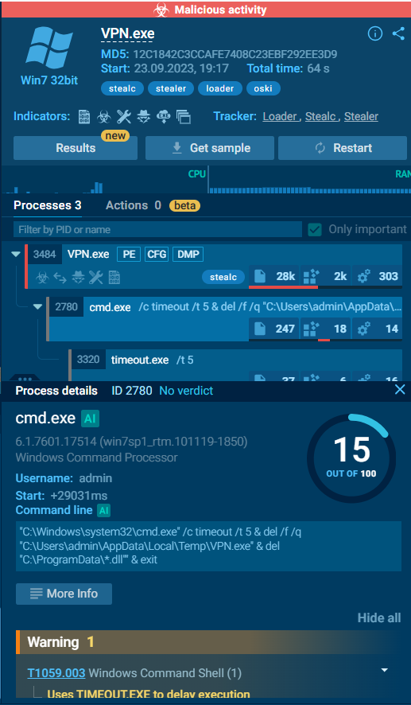

# CyberDefenders - Oski (Malware Analysis) Write-up

**Challenge:** [Oski](https://cyberdefenders.org/blueteam-ctf-challenges/oski/)  
**Platform:** [CyberDefenders](https://cyberdefenders.org/)  
**Tags:** Malware analysis, VirusTotal, ANY.RUN, Stealc, infostealer

---

## Summary

An accountant received a phishing email with a malicious attachment that led to a SIEM alert for a suspicious download linked to a PowerPoint file. Using the provided sample hash on **VirusTotal** and an **ANY.RUN** sandbox report, the payload was identified as **Stealc**-family infostealer activity (tagged `stealc`, `oski`, `stealer`, `loader`). The malware communicates with a PHP endpoint on `171.22.28.221`, downloads `sqlite3.dll` from the C2, steals credentials (MITRE **T1555**), exfiltrates data, then self-deletes after a **5-second** delay while wiping DLLs under **`C:\ProgramData`**.

---

## Scenario

The accountant at the company received an email titled **"Urgent New Order"** from a client late in the afternoon. When he attempted to access the attached invoice, he discovered it contained false order information. Subsequently, the SIEM solution generated an alert regarding downloading a potentially malicious file. Upon initial investigation, it was found that the PPT file might be responsible for this download.

---

## Objectives

- Analyze the malicious file using the provided MD5 hash.
- Identify malware timeline, C2 infrastructure, and post-infection behavior.
- Extract configuration (RC4 key) and MITRE ATT&CK techniques from sandbox analysis.
- Document evasion and cleanup behavior after exfiltration.

---

## Environment

- **Artifacts:** MD5 hash of malicious file (from lab `hash.txt` / ZIP package)
- **Tools used:**
  - [VirusTotal](https://www.virustotal.com/) — detection, history, relations, behavior
  - [ANY.RUN](https://any.run/) — dynamic analysis, Stealc config, process tree

**Related sample (ANY.RUN):** `VPN.exe` — MD5 `12C1842C3CCAFE7408C23EBF292EE3D9`  
**Report:** https://any.run/report/a040a0af8697e30506218103074c7d6ea77a84ba3ac1ee5efae20f15530a19bb/d55e2294-5377-4a45-b393-f5a8b20f7d44

---

## Evidence & Findings

### T1 — Malware creation time

**Question:** What was the time of malware creation?

- **What I checked:** VirusTotal → **Details** tab → **History** section → **Creation Time**.
- **Evidence:**

  | Field | Timestamp (UTC) |
  |-------|-----------------|
  | **Creation Time** | 2022-09-28 17:40:46 |
  | First Seen In The Wild | 2023-09-23 22:33:33 |
  | First Submission | 2023-09-23 22:02:55 |
  | Last Submission | 2025-09-29 02:35:54 |
  | Last Analysis | 2026-05-28 14:05:16 |

- **Reasoning:** The lab asks for malware **creation** time (not first seen or first submission). Use **Creation Time** from VT History.

**Answer:** **2022-09-28 17:40**

---

### T2 — C2 server (PPT / sample communication)

**Question:** Which C2 server does the malware in the PPT file communicate with?

- **What I checked:** VirusTotal **Behavior** tab (MITRE ATT&CK — C2 **T1071**); **Relations** tab → **Contacted URLs**.
- **Evidence:**

  | Scanned | Detections | URL |
  |---------|------------|-----|
  | 2026-05-28 | 14/92 | `http://171.22.28.221/5c06c05b7b34e8e6.php` |
  | 2025-06-23 | 11/97 | `http://171.22.28.221/9e226a84ec50246d/sqlite3.dll` |

- **Reasoning:** The `.php` path on the attacker host is consistent with a **C2 / web shell** endpoint. The second URL is a follow-on resource download (DLL), not the primary C2 callback URL.

**Answer:** **http://171.22.28.221/5c06c05b7b34e8e6.php**

---

### T3 — First library requested post-infection

**Question:** What is the first library that the malware requests post-infection?

- **What I checked:** VirusTotal **Behavior** tab → **HTTP requests** (successful GET to C2).
- **Evidence:**

  ```text
  GET http://171.22.28.221/9e226a84ec50246d/sqlite3.dll — HTTP 200
  ```

- **Reasoning:** Stealc downloads external DLLs from the C2 (often written under `C:\ProgramData\` and loaded). The first library retrieved in the HTTP trace is **`sqlite3.dll`**.

**Answer:** **sqlite3.dll**

---

### T4 — RC4 decryption key (ANY.RUN)

**Question:** What RC4 key is used by the malware to decrypt its base64-encoded string?

- **What I checked:** ANY.RUN report → **Stealc** configuration section.
- **Evidence:** RC4 key from sandbox config: `5329514621441247975720749009`
- **Reasoning:** Stealc stores encrypted, base64-encoded configuration; the sandbox exposes the RC4 key used for decryption.

**Answer:** **5329514621441247975720749009**

---

### T5 — MITRE technique for password theft

**Question:** Identify the main MITRE technique (not sub-technique) the malware uses to steal the user's password.

- **What I checked:** ANY.RUN MITRE ATT&CK mapping; parent technique for browser/password-store theft.
- **Evidence:** Sandbox actions include **Steal Credentials from Web Browsers** and **Steal Credentials from Password Stores** — parent technique [**T1555 — Credentials from Password Stores**](https://attack.mitre.org/techniques/T1555/).
- **Reasoning:** The lab wants the **parent** technique ID, not sub-techniques like T1555.003.

**Answer:** **T1555**

---

### T6 — Directory targeted for DLL deletion

**Question:** Which directory does the malware target for the deletion of all DLL files?

- **What I checked:** ANY.RUN process tree → child **`cmd.exe`** → command line.
- **Evidence:**

  ```text
  "C:\Windows\system32\cmd.exe" /c timeout /t 5 & del /f /q "C:\Users\admin\AppData\Local\Temp\VPN.exe" & del "C:\ProgramData\*.dll" & exit
  ```

  

- **Reasoning:** The `del "C:\ProgramData\*.dll"` command removes downloaded helper DLLs (e.g., `sqlite3.dll`) used during the infection.

**Answer:** **C:\ProgramData**

---

### T7 — Self-delete delay after exfiltration

**Question:** After successfully exfiltrating the user's data, how many seconds does it take for the malware to self-delete?

- **What I checked:** Same `cmd.exe` command line; child process **`timeout.exe`** (`timeout /t 5`).
- **Evidence:** `timeout /t 5` runs before deleting `VPN.exe` and ProgramData DLLs.
- **Reasoning:** The malware waits **5 seconds** after exfiltration so the main process can finish before cleanup (evasion / graceful exit).

**Answer:** **5**

---

## Key IOCs

| Type | Indicator |
|------|-----------|
| **C2 URL** | `http://171.22.28.221/5c06c05b7b34e8e6.php` |
| **C2 host** | `171.22.28.221` |
| **Downloaded DLL** | `http://171.22.28.221/9e226a84ec50246d/sqlite3.dll` |
| **Payload (sandbox)** | `VPN.exe` (MD5 `12C1842C3CCAFE7408C23EBF292EE3D9`) |
| **Malware family** | Stealc / Oski (infostealer, loader) |
| **RC4 key** | `5329514621441247975720749009` |
| **Cleanup path** | `C:\ProgramData\*.dll`, `%TEMP%\VPN.exe` |

---

## Attack Reconstruction

1. User opens malicious content delivered via phishing (**"Urgent New Order"** / invoice theme), leading to download/execution of **`VPN.exe`** (Stealc).
2. Malware beacons to **`http://171.22.28.221/5c06c05b7b34e8e6.php`** (C2).
3. First post-infection action: download **`sqlite3.dll`** from C2 (HTTP 200) — typical Stealc staging under **`C:\ProgramData`**.
4. Credentials stolen using [**T1555**](https://attack.mitre.org/techniques/T1555/) (password stores / browsers); config decrypted with RC4 key **`5329514621441247975720749009`**.
5. After exfiltration, **`cmd.exe`** spawns **`timeout /t 5`**, then deletes **`VPN.exe`** and all **`C:\ProgramData\*.dll`** to cover tracks.

---

## Mitigation / Hardening

- Block egress to **`171.22.28.221`** and alert on HTTP requests to random `.php` paths on raw IPs.
- Email filtering for urgent invoice/lure themes; block macro-enabled documents and untrusted attachments.
- EDR rules: Stealc/Oski tags, credential access (T1555), suspicious `del C:\ProgramData\*.dll` + `timeout /t` chains.
- User awareness for accountant/finance roles (targeted phishing).

---

## References

- Challenge: https://cyberdefenders.org/blueteam-ctf-challenges/oski/
- MITRE T1555: https://attack.mitre.org/techniques/T1555/
- ANY.RUN report: https://any.run/report/a040a0af8697e30506218103074c7d6ea77a84ba3ac1ee5efae20f15530a19bb/d55e2294-5377-4a45-b393-f5a8b20f7d44
