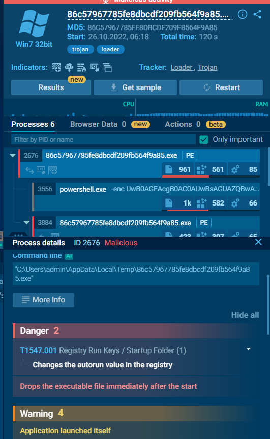
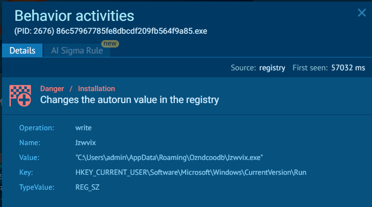

# CyberDefenders - PhishStrike (Threat Intel) Write-up

**Challenge:** [PhishStrike](https://cyberdefenders.org/blueteam-ctf-challenges/phishstrike/)  
**Platform:** [CyberDefenders](https://cyberdefenders.org/)  
**Tags:** Threat intelligence, phishing, URLHaus, BitRAT, AsyncRAT

---

## Summary

A faculty-targeted phishing email (fake **$625,000 invoice**) originated from **`18.208.22.104`** with **SPF softfail** and **DKIM fail**, return path **`erikajohana.lopez@uptc.edu.co`**, and linked to **`http://107.175.247.199/loader/install.exe`**. URLHaus pivots reveal **CoinMiner**, **BitRAT** (persistence **`Jzwvix.exe`**, C2 **`gh9st.mywire.org:5005`**, **50s** PowerShell sleep), and **AsyncRAT** exfil via Telegram bot **`bot5610920260`**.

---

## Scenario

As a cybersecurity analyst at an educational institution, you receive an alert about a phishing email targeting faculty members. The email appears to be from a trusted contact and claims a $625,000 purchase, providing a link to download an invoice.

---

## Objectives

- Investigate email headers and the malicious link using threat-intel tools.
- Extract IOCs (IPs, URLs, hashes, C2, persistence) and document findings for faculty awareness.

---

## Environment

- **Artifacts:** Phishing email (headers + body), embedded invoice URL
- **Tools:**
  - Email header analysis (Microsoft ARC / Authentication-Results)
  - [URLHaus](https://urlhaus.abuse.ch/) — malicious URL → payload tags
  - [MalwareBazaar](https://bazaar.abuse.ch/) — sample reports
  - [ANY.RUN](https://any.run/) / Triage — dynamic analysis, HTTP requests, registry
  - [VirusTotal](https://www.virustotal.com/) — C2 enrichment
  - [CyberChef](https://gchq.github.io/CyberChef/) — Base64 decode (PowerShell `-enc`)

---

## Evidence & Findings

### T1 — Sender IP (SPF softfail + DKIM fail)

**Question:** Identifying the sender's IP address with specific SPF and DKIM values helps trace the source of the phishing email. What is the sender's IP address that has an SPF value of softfail and a DKIM value of fail?

- **What I checked:** Email headers — search **`softfail`** in **ARC-Authentication-Results**.
- **Evidence:**

  ```text
  ARC-Authentication-Results: i=2; mx.microsoft.com 1;
    spf=softfail (sender ip is 18.208.22.104) smtp.rcpttodomain=fsfb.org.co smtp.mailfrom=uptc.edu.co;
    dmarc=none action=none header.from=uptc.edu.co;
    dkim=fail (no key for signature) header.d=uptc.edu.co; arc=fail (35)
  ```

- **Reasoning:** **SPF softfail** + **DKIM fail** on the same originating IP identifies the relay responsible for the spoofed **`uptc.edu.co`** sender.

**Answer:** **`18.208.22.104`**

---

### T2 — Return path

**Question:** Understanding the return path of an email is essential for tracing its origin. What is the return path specified in this email?

- **What I checked:** Email headers — **`Return-Path`** field.
- **Evidence:**

  ```text
  Return-Path: erikajohana.lopez@uptc.edu.co
  ```

- **Reasoning:** Return path defines bounce handling and often reflects the envelope sender used in the phish.

**Answer:** **`erikajohana.lopez@uptc.edu.co`**

---

### T3 — Malware distribution server IP

**Question:** Identifying the source of malware is critical for effective threat mitigation and response. What is the IP address of the server hosting the malicious file related to malware distribution?

- **What I checked:** Email body — invoice download link.
- **Evidence:**

  ```text
  VIEW INVOICE DOCUMENT HERE
  <http://107.175.247.199/loader/install.exe>
  ```

- **Reasoning:** The lure URL hosts the initial loader — block **`107.175.247.199`** and **`/loader/`** path at perimeter.

**Answer:** **`107.175.247.199`**

---

### T4 — Cryptocurrency mining malware family

**Question:** The malicious URL can deliver several malware types. Which malware family is responsible for cryptocurrency mining?

- **What I checked:** [URLHaus](https://urlhaus.abuse.ch/) lookup for **`http://107.175.247.199/loader/install.exe`** (and related URLs).
- **Evidence:** URLHaus tags associated payloads include **CoinMiner** among other families (BitRAT, AsyncRAT, etc.).
- **Reference:** https://urlhaus.abuse.ch/url/2381718/

- **Reasoning:** **CoinMiner** is the family explicitly tied to cryptomining behavior in the URLHaus payload listing.

**Answer:** **`CoinMiner`**

---

### T5 — CoinMiner HTTP request URL

**Question:** Based on the previous analysis of the cryptocurrency malware sample, what URL does this malware request?

- **What I checked:** MalwareBazaar → CoinMiner sample → ANY.RUN **HTTP Requests**.
- **Evidence:**

  ```text
  http://ripley.studio/loader/uploads/Qanjttrbv.jpeg
  ```

  Requested as subprocess of **`http://107.175.247.199/loader/server.exe`**.

- **Reasoning:** Secondary staging URL (`.jpeg` extension likely masquerading binary payload) — add to blocklist and hunt rules.

**Answer:** **`http://ripley.studio/loader/uploads/Qanjttrbv.jpeg`**

---

### T6 — BitRAT autorun executable name

**Question:** Based on the BitRAT malware sample analysis, what is the executable's name in the first value added to the registry auto-run key?

- **What I checked:** URLHaus → BitRAT → MalwareBazaar → ANY.RUN process tree and registry modification warnings.
- **Evidence:** ANY.RUN flags autorun registry change; persistence binary:

  ```text
  "C:\Users\admin\AppData\Roaming\Ozndcoodb\Jzwvix.exe"
  ```

  

  

- **Reasoning:** First autorun value points to **`Jzwvix.exe`** under a random AppData subfolder — typical BitRAT persistence.

**Answer:** **`Jzwvix.exe`**

---

### T7 — BitRAT autorun file SHA-256

**Question:** Based on the BitRAT analysis, what is the SHA-256 hash of the file previously downloaded and added to the autorun keys?

- **What I checked:** ANY.RUN sample download or MalwareBazaar → VMRay/IOCs → file details for **`Jzwvix.exe`**.
- **Evidence:** SHA-256 **`bf7628695c2df7a3020034a065397592a1f8850e59f9a448b555bc1c8c639539`**
- **Reasoning:** Hash enables host-based detection and VT/MalwareBazaar correlation across campaigns.

**Answer:** **`bf7628695c2df7a3020034a065397592a1f8850e59f9a448b555bc1c8c639539`**

---

### T8 — BitRAT loader URL

**Question:** What is the URL in the HTTP request used by the loader to retrieve the BitRAT malware?

- **What I checked:** ANY.RUN **HTTP Requests** for the BitRAT infection chain.
- **Evidence:**

  ```text
  http://107.175.247.199/loader/server.exe
  ```

- **Reasoning:** **`server.exe`** is the stage-2 loader fetched after initial **`install.exe`** — distinct URL in the same **`107.175.247.199/loader/`** infrastructure.

**Answer:** **`http://107.175.247.199/loader/server.exe`**

---

### T9 — PowerShell execution delay (seconds)

**Question:** What is the delay (in seconds) caused by the PowerShell command according to the BitRAT analysis?

- **What I checked:** ANY.RUN PowerShell process command line (Base64 **`-enc`** blob).
- **Evidence:**

  ```text
  powershell.exe -enc UwB0AGEAcgB0AC0AUwBsAGUAZQBwACAALQBTAGUAYwBvAG4AZABzACAANQAwAA==
  ```

  CyberChef Base64 decode (UTF-16LE):

  ```text
  Start-Sleep -Seconds 50
  ```

- **Reasoning:** **50-second** sleep evades sandbox timeouts and automated detonation windows (**T1497**).

**Answer:** **`50`**

---

### T10 — BitRAT C2 domain

**Question:** What is the C2 domain used by the BitRAT malware?

- **What I checked:** VirusTotal lookup on BitRAT SHA-256 **`bf7628695c2df7a3020034a065397592a1f8850e59f9a448b555bc1c8c639539`** — community comments / relations.
- **Evidence:** C2 server documented as **`gh9st.mywire.org:5005`** (domain **`gh9st.mywire.org`**, port **5005**).
- **Reasoning:** Block C2 domain and monitor DNS for **`mywire.org`** subdomains used as dynamic DNS.

**Answer:** **`gh9st.mywire.org`**

---

### T11 — AsyncRAT Telegram bot ID

**Question:** According to the AsyncRAT analysis, what is the Telegram Bot ID used by this malware?

- **What I checked:** Triage sandbox report (AsyncRAT from same URLHaus pivot) — HTTP requests to **`api.telegram.org`**.
- **Evidence:**

  ```text
  GET /bot5610920260:AAHF8huJMzSwUso7E5WSzQW0Bzo4GdubP4k/getUpdates?offset=-5 HTTP/1.1
  Host: api.telegram.org
  ```

- **Reasoning:** AsyncRAT uses Telegram for C2/exfil; bot ID **`5610920260`** (lab answer format: **`bot5610920260`**) identifies the operator channel.

**Answer:** **`bot5610920260`**

---

## Key IOCs

| Type | Indicator |
|------|-----------|
| **Phish sender IP** | `18.208.22.104` (SPF softfail, DKIM fail) |
| **Return path** | `erikajohana.lopez@uptc.edu.co` |
| **Spoofed From domain** | `uptc.edu.co` |
| **Loader host** | `107.175.247.199` |
| **Initial URL** | `http://107.175.247.199/loader/install.exe` |
| **BitRAT loader URL** | `http://107.175.247.199/loader/server.exe` |
| **CoinMiner URL** | `http://ripley.studio/loader/uploads/Qanjttrbv.jpeg` |
| **BitRAT persistence** | `%AppData%\Roaming\Ozndcoodb\Jzwvix.exe` |
| **BitRAT SHA-256** | `bf7628695c2df7a3020034a065397592a1f8850e59f9a448b555bc1c8c639539` |
| **BitRAT C2** | `gh9st.mywire.org:5005` |
| **AsyncRAT Telegram bot** | `bot5610920260` |
| **Families** | CoinMiner, BitRAT, AsyncRAT |

---

## Attack reconstruction

```text
[Phish email — fake $625K invoice]
    From: uptc.edu.co (spoofed) via 18.208.22.104
    Link: http://107.175.247.199/loader/install.exe
        |
        +→ CoinMiner → ripley.studio/.../Qanjttrbv.jpeg
        +→ BitRAT chain:
        |     server.exe → Jzwvix.exe (autorun)
        |     Start-Sleep 50 (evasion)
        |     C2 gh9st.mywire.org:5005
        +→ AsyncRAT → Telegram bot5610920260
```

---

## MITRE ATT&CK

| Technique | Name | Lab tie-in |
|-----------|------|------------|
| **T1566.002** | Phishing: Spearphishing Link | Invoice lure (T3) |
| **T1204.002** | User Execution: Malicious File | install.exe click |
| **T1105** | Ingress Tool Transfer | loader/server.exe (T8) |
| **T1547.001** | Boot or Logon Autostart Execution | Jzwvix.exe (T6) |
| **T1059.001** | PowerShell | Start-Sleep 50 (T9) |
| **T1497** | Virtualization/Sandbox Evasion | Delay before payload |
| **T1071.001** | Web Protocols | HTTP staging URLs |
| **T1102.002** | Web Service: Bidirectional Communication | Telegram bot (T11) |

---

## Mitigation / faculty guidance

1. Block **`107.175.247.199`**, **`ripley.studio`**, **`gh9st.mywire.org`**; alert on **`/loader/`** paths.
2. Email gateway: flag **SPF softfail** + **DKIM fail** from external senders impersonating **`.edu.co`** domains.
3. Hunt for **`Jzwvix.exe`** / hash **`bf762869...`** and autorun keys under random AppData folders.
4. Block **`api.telegram.org`** egress from servers (where policy allows) or alert on **`/bot*/getUpdates`** from endpoints.
5. Educate faculty: verify large purchase/invoice claims out-of-band; never run **`install.exe`** from email links.

---

## References

- Challenge: https://cyberdefenders.org/blueteam-ctf-challenges/phishstrike/
- URLHaus: https://urlhaus.abuse.ch/
- MalwareBazaar: https://bazaar.abuse.ch/
- MITRE T1566: https://attack.mitre.org/techniques/T1566/
